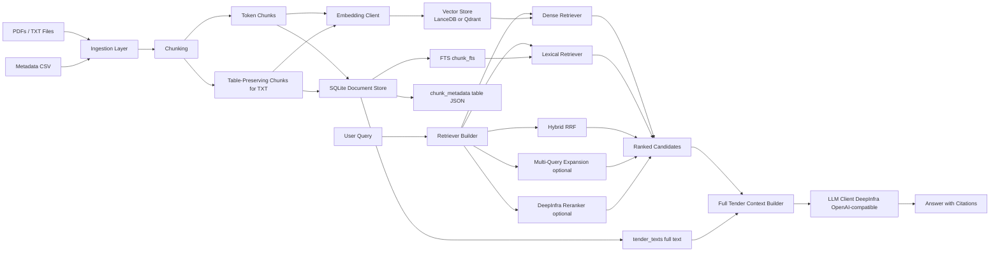
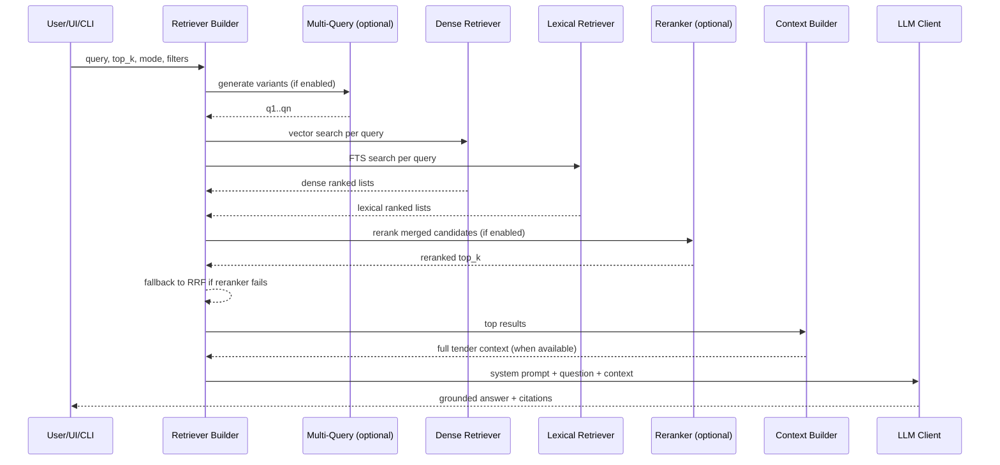
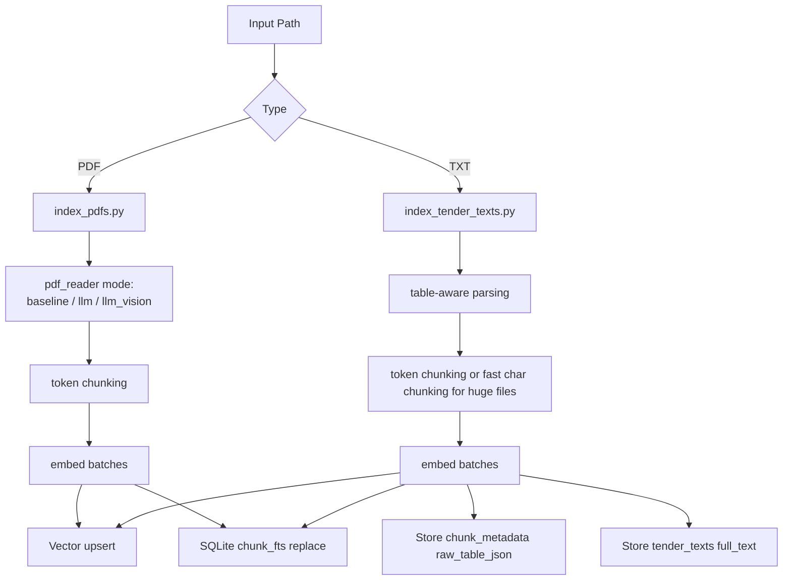

# RAG Finance Docs

Enterprise Retrieval-Augmented Generation (RAG) pipeline for tender and finance documents with metadata-aware retrieval, optional query expansion, reranking, and citation-grounded answers.

## What Is Implemented

- Multi-source ingestion: PDF indexing plus pre-extracted text indexing.
- Metadata-aware retrieval with `dense`, `lexical`, and `hybrid` modes.
- Optional multi-query expansion and DeepInfra reranking.
- Full-tender context assembly for higher-answer completeness.
- UI + CLI interfaces for search and grounded Q&A.
- Retrieval benchmark script with `recall@k`, `precision@k`, `MRR@k`, and `NDCG@k`.

## Updated End-to-End Flow

1. Ingest documents (`.pdf` or `.txt`) and attach tender metadata from CSV.
2. Chunk content (token chunking, plus table-aware chunking for text ingestion).
3. Generate embeddings and upsert vectors to LanceDB or Qdrant.
4. Index lexical chunks and tender-level full text in SQLite.
5. At query time, retrieve with dense/lexical/hybrid (and optional multi-query + reranker).
6. Build final LLM context (including full text for top tender IDs when available).
7. Generate grounded answer with citation formatting and fallback citation injection.

## System Design Diagrams

### 1) Full Architecture (Components)



### 2) Query-Time Sequence



### 3) Ingestion Flow (PDF and Text)



## Improvements in This Version

- Added optional **multi-query retrieval** with LLM-generated query variants.
- Added optional **DeepInfra reranker** and automatic fallback to RRF on reranker failure.
- Added **full-tender context assembly** to pass richer evidence into answer generation.
- Added **table-aware text ingestion** with `raw_table_json` persistence for structured table context.
- Added **LLM-based PDF reader modes** (`llm`, `llm_vision`) with baseline fallback.
- Added **metadata-aware filters** in search CLI for organization, tender ID, and date ranges.
- Added **debug artifact outputs** (`generated_queries.json`, `dense_results.json`, `lexical_results.json`, `reranker_candidates.json`, `reranked_results.json`, `fused_results.json`) to inspect ranking behavior.

## Repository Structure

```text
app/
  config.py
  db/
    sqlite_store.py
    vector_store.py
  embeddings/
    client.py
  ingestion/
    index_pdfs.py
    index_tender_texts.py
    pdf_reader_llm.py
  retrieval/
    pipeline.py
  query/
    search.py
  llm/
    client.py
  ui/
    embedding_gradio.py
    embedding_gui.py
  evaluation/
    score_qna_accuracy.py
```

## Setup

### Prerequisites

- Python 3.10+
- `pip`
- Optional: Qdrant server when using `VECTOR_DB_PROVIDER=qdrant`
- Optional OCR/vision runtime dependencies depending on your PDF ingestion mode

### Install

```bash
python -m venv .venv
# Windows PowerShell
.venv\Scripts\activate
pip install -r requirements.txt
copy .env.example .env
```

## Configuration

Core variables:

- `EMBEDDING_PROVIDER` = `openai | azure | local`
- `OPENAI_API_KEY`, `OPENAI_EMBEDDING_MODEL`
- `LLM_PROVIDER`, `DEEPINFRA_API_KEY`, `DEEPINFRA_BASE_URL`, `DEEPINFRA_MODEL`
- `VECTOR_DB_PROVIDER` = `lancedb | qdrant`
- `SQLITE_DB_PATH`, `LANCEDB_DIR`, `QDRANT_URL`
- `RETRIEVAL_MODE` = `dense | lexical | hybrid`
- `HYBRID_RRF_K`, `HYBRID_CANDIDATE_MULTIPLIER`

Advanced retrieval flags (supported by `Settings`):

- `MULTI_QUERY_ENABLED`, `MULTI_QUERY_COUNT`, `MULTI_QUERY_LANGUAGE`
- `RERANKER_ENABLED`, `RERANKER_MODEL`, `RERANKER_INSTRUCTION`
- `RERANKER_TOP_K_MULTIPLIER`, `RERANKER_SERVICE_TIER`, `DEEPINFRA_RERANKER_BASE_URL`

## Usage

### 1) Index PDFs

```bash
python -m app.ingestion.index_pdfs \
  --input sample_data_pdf \
  --metadata-csv tenders_data.csv \
  --table tenders_data \
  --pdf-reader-mode baseline
```

Use `--pdf-reader-mode llm` or `--pdf-reader-mode llm_vision` when needed.

### 2) Index Pre-Extracted Text

```bash
python -m app.ingestion.index_tender_texts \
  --input mini_tenders_data_text \
  --metadata-csv tenders_data.csv \
  --table mini_data_text
```

### 3) Run Retrieval Search

```bash
python -m app.query.search \
  --query "What is the bid submission end date?" \
  --top-k 5 \
  --retrieval-mode hybrid \
  --table tenders_data
```

Filter examples:

```bash
python -m app.query.search \
  --query "upcoming tender deadlines" \
  --organization-eq "MUNICIPAL CORPORATION OF GREATER MUMBAI" \
  --publish-date-after "10-Feb-2026 10:00 AM"
```

### 4) Launch UI

```bash
python -m app.ui.embedding_gradio
# or
python -m app.ui.embedding_gui
```

### 5) Evaluate Retrieval Quality

```bash
python -m app.evaluation.score_qna_accuracy \
  --input qna_data.csv \
  --output retrieval_benchmark_results.csv \
  --table tenders_data \
  --k-values 1,3,5,10
```

## Citation and Safety Behavior

- Answers are instructed to use only provided context.
- `<think>...</think>` blocks are stripped from model output.
- If model output lacks citations, fallback citations are appended automatically.
- If context is insufficient, expected response is:
  `Insufficient information in the provided documents.`

## Current Limitations

- No dedicated production API server layer yet (primarily CLI/UI driven).
- Quality is sensitive to extraction/chunking quality and embedding/reranker model choice.
- Citation attachment is robust but still heuristic in ambiguous multi-source cases.

## Quick Start Checklist

- Configure `.env` with embedding + DeepInfra credentials.
- Index corpus via `app.ingestion.index_pdfs` or `app.ingestion.index_tender_texts`.
- Run `app.query.search` to validate retrieval quality.
- Launch Gradio/Tkinter UI for interactive grounded Q&A.
- Run `app.evaluation.score_qna_accuracy` for measurable retrieval metrics.

